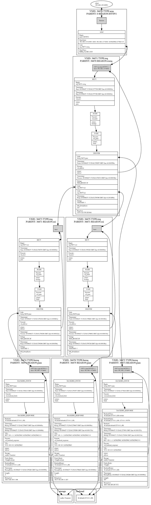

==============
vsltrans
==============

-----------------------------------
Re-format tool for vsl(varnishlog)
-----------------------------------

:Author: Shohei Tanaka(@xcir)
:Date: 2016-05-04
:Version: 0.6-varnish40
:Support Varnish Version: 4.1.x, 4.0.x
:Manual section: 1

For Varnish3.0.x
=================
See this link.
https://github.com/xcir/vsltrans/tree/varnish30

DESCRIPTION
===========
Re-format tool for vsl(varnishlog)

OPTION
===========
::

  -q [VSL-Query] -f [file-name] --sopath [libvarnishapi.so] -n [instance-name] -j -d

HOW TO USE
===========

Read from log-file(raw/vxid/request/session)
---------------------------------------------
::

  ./vsltrans.py -f test.log

Using VSL Query Expressions
--------------------------------------------
::

  # Does not support the VSL-Query, if read from log-file.
  ./vsltrans.py -q "requrl ~ '^/test'"

Output DOT format
---------------------------------------------
::

  ./vsltrans.py -d

Output JSON format
---------------------------------------------
::

  #This option dump the internal data.
  ./vsltrans.py -j

OUTPUT SAMPLE
===============

./vsltrans.py -f samplelog -d | tail -n1 | dot -Tpng > samplelog.png
---------------------------------------------------

./vsltrans.py -f samplelog
---------------------------------------------------
::

  ************************************************************
  *                         Variable                         *
  ************************************************************
  
  ########################################
  #                Start                 #
  ########################################
  #              VXID:34478              #
  ########################################
     | 
  >>>>>>>>>>>>>>>>>>>>>>>>>>>>>>>>>>>>>>>>
  >               vcl_recv               >
  >>>>>>>>>>>>>>>>>>>>>>>>>>>>>>>>>>>>>>>>
     | 
     | +--------------------------+-------------------------+---------------------+---------------------+
     | |                      key |   Before vcl funciton   |   In vcl function   | After vcl function  | 
     | +--------------------------+-------------------------+---------------------+---------------------+
     | |                client.ip | '192.168.1.30 43853'    |                     |                     | 
     | |          req.http.Accept | '*/*'                   |                     |                     | 
     | |      req.http.Connection | 'Keep-Alive'            |                     |                     | 
     | |            req.http.Host | '192.168.1.37:6081'     |                     |                     | 
     | |      req.http.User-Agent | 'Wget/1.15 (linux-gnu)' |                     |                     | 
     | | req.http.X-Forwarded-For | '192.168.1.30'          |                     |                     | 
     | |        req.http.hogehoge |                         | 'mage'              |                     | 
     | |               req.method | 'GET'                   |                     |                     | 
     | |                req.proto | 'HTTP/1.1'              |                     |                     | 
     | |                  req.url | '/esi.html'             |                     |                     | 
     | +--------------------------+-------------------------+---------------------+---------------------+
     | 
  >>>>>>>>>>>>>>>>>>>>>>>>>>>>>>>>>>>>>>>>
  >               vcl_hash               >
  >>>>>>>>>>>>>>>>>>>>>>>>>>>>>>>>>>>>>>>>
     | 
     | 
  >>>>>>>>>>>>>>>>>>>>>>>>>>>>>>>>>>>>>>>>
  >               vcl_pass               >
  >>>>>>>>>>>>>>>>>>>>>>>>>>>>>>>>>>>>>>>>
     | 
     |                 | 
     |                 > ########################################
     |                 > #              VXID:34479              #
     |                 > ########################################
     |                 >    | 
     |                 > >>>>>>>>>>>>>>>>>>>>>>>>>>>>>>>>>>>>>>>>
     |                 > >          vcl_backend_fetch           >
     |                 > >>>>>>>>>>>>>>>>>>>>>>>>>>>>>>>>>>>>>>>>
     |                 >    | 
     |                 >    | +----------------------------+-------------------------+---------------------+---------------------+
     |                 >    | |                        key |   Before vcl funciton   |   In vcl function   | After vcl function  | 
     |                 >    | +----------------------------+-------------------------+---------------------+---------------------+
     |                 >    | |          bereq.http.Accept | '*/*'                   |                     |                     | 
     |                 >    | |            bereq.http.Host | '192.168.1.37:6081'     |                     |                     | 
     |                 >    | |      bereq.http.User-Agent | 'Wget/1.15 (linux-gnu)' |                     |                     | 
     |                 >    | | bereq.http.X-Forwarded-For | '192.168.1.30'          |                     |                     | 
     |                 >    | |       bereq.http.X-Varnish | '34479'                 |                     |                     | 
     |                 >    | |        bereq.http.hogehoge | 'mage'                  |                     |                     | 
     |                 >    | |               bereq.method | 'GET'                   |                     |                     | 
     |                 >    | |                bereq.proto | 'HTTP/1.1'              |                     |                     | 
     |                 >    | |                  bereq.url | '/esi.html'             |                     |                     | 
     |                 >    | +----------------------------+-------------------------+---------------------+---------------------+
     |                 >    | 
     |                 > >>>>>>>>>>>>>>>>>>>>>>>>>>>>>>>>>>>>>>>>
     |                 > >         vcl_backend_response         >
     |                 > >>>>>>>>>>>>>>>>>>>>>>>>>>>>>>>>>>>>>>>>
     |                 >    | 
     |                 >    | +----------------------------+---------------------------------+---------------------+---------------------------------+
     |                 >    | |                        key |       Before vcl funciton       |   In vcl function   |       After vcl function        | 
     |                 >    | +----------------------------+---------------------------------+---------------------+---------------------------------+
     |                 >    | |  beresp.http.Accept-Ranges | 'bytes'                         |                     |                                 | 
     |                 >    | | beresp.http.Content-Length | '287'                           |                     |                                 | 
     |                 >    | |   beresp.http.Content-Type | 'text/html'                     |                     |                                 | 
     |                 >    | |           beresp.http.Date | 'Sat, 27 Jun 2015 17:26:06 GMT' |                     |                                 | 
     |                 >    | |           beresp.http.ETag | '"281399-11f-5197b7d0b403a"'    |                     |                                 | 
     |                 >    | |  beresp.http.Last-Modified | 'Sat, 27 Jun 2015 08:17:33 GMT' |                     |                                 | 
     |                 >    | |         beresp.http.Server | 'Apache/2.2.22 (Ubuntu)'        |                     |                                 | 
     |                 >    | |           beresp.http.Vary | 'Accept-Encoding'               |                     |                                 | 
     |                 >    | |          beresp.http.X-Pad | 'avoid browser bug'             |                     |                                 | 
     |                 >    | |               beresp.proto | 'HTTP/1.1'                      |                     |                                 | 
     |                 >    | |              beresp.reason | 'OK'                            |                     |                                 | 
     |                 >    | |              beresp.status | '200'                           |                     |                                 | 
     |                 >    | |     obj.http.Accept-Ranges |                                 |                     | 'bytes'                         | 
     |                 >    | |    obj.http.Content-Length |                                 |                     | '287'                           | 
     |                 >    | |      obj.http.Content-Type |                                 |                     | 'text/html'                     | 
     |                 >    | |              obj.http.Date |                                 |                     | 'Sat, 27 Jun 2015 17:26:06 GMT' | 
     |                 >    | |              obj.http.ETag |                                 |                     | '"281399-11f-5197b7d0b403a"'    | 
     |                 >    | |     obj.http.Last-Modified |                                 |                     | 'Sat, 27 Jun 2015 08:17:33 GMT' | 
     |                 >    | |            obj.http.Server |                                 |                     | 'Apache/2.2.22 (Ubuntu)'        | 
     |                 >    | |              obj.http.Vary |                                 |                     | 'Accept-Encoding'               | 
     |                 >    | |             obj.http.X-Pad |                                 |                     | 'avoid browser bug'             | 
     |                 >    | |                  obj.proto |                                 |                     | 'HTTP/1.1'                      | 
     |                 >    | |                 obj.reason |                                 |                     | 'OK'                            | 
     |                 >    | |                 obj.status |                                 |                     | '200'                           | 
     |                 >    | +----------------------------+---------------------------------+---------------------+---------------------------------+
     | 
  >>>>>>>>>>>>>>>>>>>>>>>>>>>>>>>>>>>>>>>>
  >             vcl_deliver              >
  >>>>>>>>>>>>>>>>>>>>>>>>>>>>>>>>>>>>>>>>
     | 
     | +-----------------------------+---------------------------------+---------------------+------------------------------------------------------+
     | |                         key |       Before vcl funciton       |   In vcl function   |                  After vcl function                  | 
     | +-----------------------------+---------------------------------+---------------------+------------------------------------------------------+
     | |             req.http.Accept |                                 |                     | '*/*' -> '*/*'                                       | 
     | |         req.http.Connection |                                 |                     | 'Keep-Alive' -> 'Keep-Alive'                         | 
     | |               req.http.Host |                                 |                     | '192.168.1.37:6081' -> '192.168.1.37:6081'           | 
     | |         req.http.User-Agent |                                 |                     | 'Wget/1.15 (linux-gnu)' -> 'Wget/1.15 (linux-gnu)'   | 
     | |    req.http.X-Forwarded-For |                                 |                     | '192.168.1.30' -> '192.168.1.30'                     | 
     | |               req.http.hoge |                                 | 'xxx'               | 'xxx' -> 'xxx'                                       | 
     | |           req.http.hogehoge |                                 |                     | 'mage' -> 'mage'                                     | 
     | |                  req.method |                                 |                     | 'GET' -> 'GET'                                       | 
     | |                   req.proto |                                 |                     | 'HTTP/1.1' -> 'HTTP/1.1'                             | 
     | |                     req.url |                                 |                     | '/slow.php' -> '/slow.php' -> '/x.html' -> '/x.html' | 
     | |     resp.http.Accept-Ranges | 'bytes'                         |                     |                                                      | 
     | |               resp.http.Age | '0'                             |                     |                                                      | 
     | |        resp.http.Connection |                                 |                     | 'keep-alive'                                         | 
     | |    resp.http.Content-Length | '287'                           |                     | [unset]                                              | 
     | |      resp.http.Content-Type | 'text/html'                     |                     |                                                      | 
     | |              resp.http.Date | 'Sat, 27 Jun 2015 17:26:06 GMT' |                     |                                                      | 
     | |              resp.http.ETag | '"281399-11f-5197b7d0b403a"'    |                     | [unset] -> 'W/"281399-11f-5197b7d0b403a"'            | 
     | |     resp.http.Last-Modified | 'Sat, 27 Jun 2015 08:17:33 GMT' |                     |                                                      | 
     | |            resp.http.Server | 'Apache/2.2.22 (Ubuntu)'        |                     |                                                      | 
     | | resp.http.Transfer-Encoding |                                 |                     | 'chunked'                                            | 
     | |              resp.http.Vary | 'Accept-Encoding'               |                     |                                                      | 
     | |               resp.http.Via | '1.1 varnish-v4'                |                     |                                                      | 
     | |             resp.http.X-Pad | 'avoid browser bug'             |                     |                                                      | 
     | |         resp.http.X-Varnish | '34478'                         |                     |                                                      | 
     | |          resp.http.restarts |                                 | '0'                 |                                                      | 
     | |      resp.http.x-powered-by |                                 | 'hoge' -> [unset]   |                                                      | 
     | |                  resp.proto | 'HTTP/1.1'                      |                     |                                                      | 
     | |                 resp.reason | 'OK'                            |                     |                                                      | 
     | |                 resp.status | '200'                           |                     |                                                      | 
     | +-----------------------------+---------------------------------+---------------------+------------------------------------------------------+
     |                 | 
     |                 > ########################################
     |                 > #                 ESI                  #
     |                 > ########################################
     |                 > #              VXID:34480              #
     |                 > ########################################
     |                 >    | 
     |                 > >>>>>>>>>>>>>>>>>>>>>>>>>>>>>>>>>>>>>>>>
     |                 > >               vcl_recv               >
     |                 > >>>>>>>>>>>>>>>>>>>>>>>>>>>>>>>>>>>>>>>>
     |                 >    | 
     |                 >    | +---------------------+----------------------+---------------------+---------------------+
     |                 >    | |                 key | Before vcl funciton  |   In vcl function   | After vcl function  | 
     |                 >    | +---------------------+----------------------+---------------------+---------------------+
     |                 >    | |           client.ip | '192.168.1.30 43853' |                     |                     | 
     |                 >    | +---------------------+----------------------+---------------------+---------------------+
     |                 >    | 
     |                 > >>>>>>>>>>>>>>>>>>>>>>>>>>>>>>>>>>>>>>>>
     |                 > >               vcl_hash               >
     |                 > >>>>>>>>>>>>>>>>>>>>>>>>>>>>>>>>>>>>>>>>
     |                 >    | 
     |                 >    | 
     |                 > >>>>>>>>>>>>>>>>>>>>>>>>>>>>>>>>>>>>>>>>
     |                 > >               vcl_pass               >
     |                 > >>>>>>>>>>>>>>>>>>>>>>>>>>>>>>>>>>>>>>>>
     |                 >    | 
     |                 >    |                 | 
     |                 >    |                 > ########################################
     |                 >    |                 > #              VXID:34481              #
     |                 >    |                 > ########################################
     |                 >    |                 >    | 
     |                 >    |                 > >>>>>>>>>>>>>>>>>>>>>>>>>>>>>>>>>>>>>>>>
     |                 >    |                 > >          vcl_backend_fetch           >
     |                 >    |                 > >>>>>>>>>>>>>>>>>>>>>>>>>>>>>>>>>>>>>>>>
     |                 >    |                 >    | 
     |                 >    |                 >    | +----------------------------+-------------------------+---------------------+---------------------+
     |                 >    |                 >    | |                        key |   Before vcl funciton   |   In vcl function   | After vcl function  | 
     |                 >    |                 >    | +----------------------------+-------------------------+---------------------+---------------------+
     |                 >    |                 >    | |          bereq.http.Accept | '*/*'                   |                     |                     | 
     |                 >    |                 >    | |            bereq.http.Host | '192.168.1.37:6081'     |                     |                     | 
     |                 >    |                 >    | |      bereq.http.User-Agent | 'Wget/1.15 (linux-gnu)' |                     |                     | 
     |                 >    |                 >    | | bereq.http.X-Forwarded-For | '192.168.1.30'          |                     |                     | 
     |                 >    |                 >    | |       bereq.http.X-Varnish | '34481'                 |                     |                     | 
     |                 >    |                 >    | |        bereq.http.hogehoge | 'mage'                  |                     |                     | 
     |                 >    |                 >    | |               bereq.method | 'GET'                   |                     |                     | 
     |                 >    |                 >    | |                bereq.proto | 'HTTP/1.1'              |                     |                     | 
     |                 >    |                 >    | |                  bereq.url | '/slow.php'             |                     |                     | 
     |                 >    |                 >    | +----------------------------+-------------------------+---------------------+---------------------+
     |                 >    |                 >    | 
     |                 >    |                 > >>>>>>>>>>>>>>>>>>>>>>>>>>>>>>>>>>>>>>>>
     |                 >    |                 > >         vcl_backend_response         >
     |                 >    |                 > >>>>>>>>>>>>>>>>>>>>>>>>>>>>>>>>>>>>>>>>
     |                 >    |                 >    | 
     |                 >    |                 >    | +----------------------------+---------------------------------+---------------------+---------------------------------+
     |                 >    |                 >    | |                        key |       Before vcl funciton       |   In vcl function   |       After vcl function        | 
     |                 >    |                 >    | +----------------------------+---------------------------------+---------------------+---------------------------------+
     |                 >    |                 >    | | beresp.http.Content-Length | '3'                             |                     |                                 | 
     |                 >    |                 >    | |   beresp.http.Content-Type | 'text/html'                     |                     |                                 | 
     |                 >    |                 >    | |           beresp.http.Date | 'Sat, 27 Jun 2015 17:26:06 GMT' |                     |                                 | 
     |                 >    |                 >    | |         beresp.http.Server | 'Apache/2.2.22 (Ubuntu)'        |                     |                                 | 
     |                 >    |                 >    | |           beresp.http.Vary | 'Accept-Encoding'               |                     |                                 | 
     |                 >    |                 >    | |   beresp.http.X-Powered-By | 'PHP/5.3.10-1ubuntu3.13'        |                     |                                 | 
     |                 >    |                 >    | |               beresp.proto | 'HTTP/1.1'                      |                     |                                 | 
     |                 >    |                 >    | |              beresp.reason | 'OK'                            |                     |                                 | 
     |                 >    |                 >    | |              beresp.status | '200'                           |                     |                                 | 
     |                 >    |                 >    | |    obj.http.Content-Length |                                 |                     | '3'                             | 
     |                 >    |                 >    | |      obj.http.Content-Type |                                 |                     | 'text/html'                     | 
     |                 >    |                 >    | |              obj.http.Date |                                 |                     | 'Sat, 27 Jun 2015 17:26:06 GMT' | 
     |                 >    |                 >    | |            obj.http.Server |                                 |                     | 'Apache/2.2.22 (Ubuntu)'        | 
     |                 >    |                 >    | |              obj.http.Vary |                                 |                     | 'Accept-Encoding'               | 
     |                 >    |                 >    | |      obj.http.X-Powered-By |                                 |                     | 'PHP/5.3.10-1ubuntu3.13'        | 
     |                 >    |                 >    | |                  obj.proto |                                 |                     | 'HTTP/1.1'                      | 
     |                 >    |                 >    | |                 obj.reason |                                 |                     | 'OK'                            | 
     |                 >    |                 >    | |                 obj.status |                                 |                     | '200'                           | 
     |                 >    |                 >    | +----------------------------+---------------------------------+---------------------+---------------------------------+
     |                 >    | 
     |                 > >>>>>>>>>>>>>>>>>>>>>>>>>>>>>>>>>>>>>>>>
     |                 > >             vcl_deliver              >
     |                 > >>>>>>>>>>>>>>>>>>>>>>>>>>>>>>>>>>>>>>>>
     |                 >    | 
     |                 >    | +-----------------------------+---------------------------------+---------------------+---------------------+
     |                 >    | |                         key |       Before vcl funciton       |   In vcl function   | After vcl function  | 
     |                 >    | +-----------------------------+---------------------------------+---------------------+---------------------+
     |                 >    | |               resp.http.Age | '0'                             |                     |                     | 
     |                 >    | |        resp.http.Connection |                                 |                     | 'keep-alive'        | 
     |                 >    | |    resp.http.Content-Length | '3'                             |                     | [unset]             | 
     |                 >    | |      resp.http.Content-Type | 'text/html'                     |                     |                     | 
     |                 >    | |              resp.http.Date | 'Sat, 27 Jun 2015 17:26:06 GMT' |                     |                     | 
     |                 >    | |            resp.http.Server | 'Apache/2.2.22 (Ubuntu)'        |                     |                     | 
     |                 >    | | resp.http.Transfer-Encoding |                                 |                     | 'chunked'           | 
     |                 >    | |              resp.http.Vary | 'Accept-Encoding'               |                     |                     | 
     |                 >    | |               resp.http.Via | '1.1 varnish-v4'                |                     |                     | 
     |                 >    | |      resp.http.X-Powered-By | 'PHP/5.3.10-1ubuntu3.13'        | [unset]             |                     | 
     |                 >    | |         resp.http.X-Varnish | '34480'                         |                     |                     | 
     |                 >    | |          resp.http.restarts |                                 | '0'                 |                     | 
     |                 >    | |      resp.http.x-powered-by |                                 | 'hoge' -> [unset]   |                     | 
     |                 >    | |                  resp.proto | 'HTTP/1.1'                      |                     |                     | 
     |                 >    | |                 resp.reason | 'OK'                            |                     |                     | 
     |                 >    | |                 resp.status | '200'                           |                     |                     | 
     |                 >    | +-----------------------------+---------------------------------+---------------------+---------------------+
     |                 | 
     |                 > ########################################
     |                 > #                 ESI                  #
     |                 > ########################################
     |                 > #              VXID:34482              #
     |                 > ########################################
     |                 >    | 
     |                 > >>>>>>>>>>>>>>>>>>>>>>>>>>>>>>>>>>>>>>>>
     |                 > >               vcl_recv               >
     |                 > >>>>>>>>>>>>>>>>>>>>>>>>>>>>>>>>>>>>>>>>
     |                 >    | 
     |                 >    | +---------------------+----------------------+---------------------+---------------------+
     |                 >    | |                 key | Before vcl funciton  |   In vcl function   | After vcl function  | 
     |                 >    | +---------------------+----------------------+---------------------+---------------------+
     |                 >    | |           client.ip | '192.168.1.30 43853' |                     |                     | 
     |                 >    | +---------------------+----------------------+---------------------+---------------------+
     |                 >    | 
     |                 > >>>>>>>>>>>>>>>>>>>>>>>>>>>>>>>>>>>>>>>>
     |                 > >               vcl_hash               >
     |                 > >>>>>>>>>>>>>>>>>>>>>>>>>>>>>>>>>>>>>>>>
     |                 >    | 
     |                 >    | 
     |                 > >>>>>>>>>>>>>>>>>>>>>>>>>>>>>>>>>>>>>>>>
     |                 > >               vcl_pass               >
     |                 > >>>>>>>>>>>>>>>>>>>>>>>>>>>>>>>>>>>>>>>>
     |                 >    | 
     |                 >    |                 | 
     |                 >    |                 > ########################################
     |                 >    |                 > #              VXID:34483              #
     |                 >    |                 > ########################################
     |                 >    |                 >    | 
     |                 >    |                 > >>>>>>>>>>>>>>>>>>>>>>>>>>>>>>>>>>>>>>>>
     |                 >    |                 > >          vcl_backend_fetch           >
     |                 >    |                 > >>>>>>>>>>>>>>>>>>>>>>>>>>>>>>>>>>>>>>>>
     |                 >    |                 >    | 
     |                 >    |                 >    | +----------------------------+-------------------------+---------------------+---------------------+
     |                 >    |                 >    | |                        key |   Before vcl funciton   |   In vcl function   | After vcl function  | 
     |                 >    |                 >    | +----------------------------+-------------------------+---------------------+---------------------+
     |                 >    |                 >    | |          bereq.http.Accept | '*/*'                   |                     |                     | 
     |                 >    |                 >    | |            bereq.http.Host | '192.168.1.37:6081'     |                     |                     | 
     |                 >    |                 >    | |      bereq.http.User-Agent | 'Wget/1.15 (linux-gnu)' |                     |                     | 
     |                 >    |                 >    | | bereq.http.X-Forwarded-For | '192.168.1.30'          |                     |                     | 
     |                 >    |                 >    | |       bereq.http.X-Varnish | '34483'                 |                     |                     | 
     |                 >    |                 >    | |        bereq.http.hogehoge | 'mage'                  |                     |                     | 
     |                 >    |                 >    | |               bereq.method | 'GET'                   |                     |                     | 
     |                 >    |                 >    | |                bereq.proto | 'HTTP/1.1'              |                     |                     | 
     |                 >    |                 >    | |                  bereq.url | '/x.html'               |                     |                     | 
     |                 >    |                 >    | +----------------------------+-------------------------+---------------------+---------------------+
     |                 >    |                 >    | 
     |                 >    |                 > >>>>>>>>>>>>>>>>>>>>>>>>>>>>>>>>>>>>>>>>
     |                 >    |                 > >         vcl_backend_response         >
     |                 >    |                 > >>>>>>>>>>>>>>>>>>>>>>>>>>>>>>>>>>>>>>>>
     |                 >    |                 >    | 
     |                 >    |                 >    | +----------------------------+---------------------------------+---------------------+---------------------------------+
     |                 >    |                 >    | |                        key |       Before vcl funciton       |   In vcl function   |       After vcl function        | 
     |                 >    |                 >    | +----------------------------+---------------------------------+---------------------+---------------------------------+
     |                 >    |                 >    | |  beresp.http.Accept-Ranges | 'bytes'                         |                     |                                 | 
     |                 >    |                 >    | | beresp.http.Content-Length | '11'                            |                     |                                 | 
     |                 >    |                 >    | |   beresp.http.Content-Type | 'text/html'                     |                     |                                 | 
     |                 >    |                 >    | |           beresp.http.Date | 'Sat, 27 Jun 2015 17:26:07 GMT' |                     |                                 | 
     |                 >    |                 >    | |           beresp.http.ETag | '"280ea4-b-50f5f855c1b9e"'      |                     |                                 | 
     |                 >    |                 >    | |  beresp.http.Last-Modified | 'Wed, 18 Feb 2015 16:43:37 GMT' |                     |                                 | 
     |                 >    |                 >    | |         beresp.http.Server | 'Apache/2.2.22 (Ubuntu)'        |                     |                                 | 
     |                 >    |                 >    | |           beresp.http.Vary | 'Accept-Encoding'               |                     |                                 | 
     |                 >    |                 >    | |               beresp.proto | 'HTTP/1.1'                      |                     |                                 | 
     |                 >    |                 >    | |              beresp.reason | 'OK'                            |                     |                                 | 
     |                 >    |                 >    | |              beresp.status | '200'                           |                     |                                 | 
     |                 >    |                 >    | |     obj.http.Accept-Ranges |                                 |                     | 'bytes'                         | 
     |                 >    |                 >    | |    obj.http.Content-Length |                                 |                     | '11'                            | 
     |                 >    |                 >    | |      obj.http.Content-Type |                                 |                     | 'text/html'                     | 
     |                 >    |                 >    | |              obj.http.Date |                                 |                     | 'Sat, 27 Jun 2015 17:26:07 GMT' | 
     |                 >    |                 >    | |              obj.http.ETag |                                 |                     | '"280ea4-b-50f5f855c1b9e"'      | 
     |                 >    |                 >    | |     obj.http.Last-Modified |                                 |                     | 'Wed, 18 Feb 2015 16:43:37 GMT' | 
     |                 >    |                 >    | |            obj.http.Server |                                 |                     | 'Apache/2.2.22 (Ubuntu)'        | 
     |                 >    |                 >    | |              obj.http.Vary |                                 |                     | 'Accept-Encoding'               | 
     |                 >    |                 >    | |                  obj.proto |                                 |                     | 'HTTP/1.1'                      | 
     |                 >    |                 >    | |                 obj.reason |                                 |                     | 'OK'                            | 
     |                 >    |                 >    | |                 obj.status |                                 |                     | '200'                           | 
     |                 >    |                 >    | +----------------------------+---------------------------------+---------------------+---------------------------------+
     |                 >    | 
     |                 > >>>>>>>>>>>>>>>>>>>>>>>>>>>>>>>>>>>>>>>>
     |                 > >             vcl_deliver              >
     |                 > >>>>>>>>>>>>>>>>>>>>>>>>>>>>>>>>>>>>>>>>
     |                 >    | 
     |                 >    | +-----------------------------+---------------------------------+---------------------+-----------------------------------------+
     |                 >    | |                         key |       Before vcl funciton       |   In vcl function   |           After vcl function            | 
     |                 >    | +-----------------------------+---------------------------------+---------------------+-----------------------------------------+
     |                 >    | |     resp.http.Accept-Ranges | 'bytes'                         |                     |                                         | 
     |                 >    | |               resp.http.Age | '0'                             |                     |                                         | 
     |                 >    | |        resp.http.Connection |                                 |                     | 'keep-alive'                            | 
     |                 >    | |    resp.http.Content-Length | '11'                            |                     | [unset]                                 | 
     |                 >    | |      resp.http.Content-Type | 'text/html'                     |                     |                                         | 
     |                 >    | |              resp.http.Date | 'Sat, 27 Jun 2015 17:26:07 GMT' |                     |                                         | 
     |                 >    | |              resp.http.ETag | '"280ea4-b-50f5f855c1b9e"'      |                     | [unset] -> 'W/"280ea4-b-50f5f855c1b9e"' | 
     |                 >    | |     resp.http.Last-Modified | 'Wed, 18 Feb 2015 16:43:37 GMT' |                     |                                         | 
     |                 >    | |            resp.http.Server | 'Apache/2.2.22 (Ubuntu)'        |                     |                                         | 
     |                 >    | | resp.http.Transfer-Encoding |                                 |                     | 'chunked'                               | 
     |                 >    | |              resp.http.Vary | 'Accept-Encoding'               |                     |                                         | 
     |                 >    | |               resp.http.Via | '1.1 varnish-v4'                |                     |                                         | 
     |                 >    | |         resp.http.X-Varnish | '34482'                         |                     |                                         | 
     |                 >    | |          resp.http.restarts |                                 | '0'                 |                                         | 
     |                 >    | |      resp.http.x-powered-by |                                 | 'hoge' -> [unset]   |                                         | 
     |                 >    | |                  resp.proto | 'HTTP/1.1'                      |                     |                                         | 
     |                 >    | |                 resp.reason | 'OK'                            |                     |                                         | 
     |                 >    | |                 resp.status | '200'                           |                     |                                         | 
     |                 >    | +-----------------------------+---------------------------------+---------------------+-----------------------------------------+
  
  
  ************************************************************
  *                          Event                           *
  ************************************************************
  
  ########################################
  #                Start                 #
  ########################################
  #              VXID:34478              #
  ########################################
     |       Timestamp | Start: 2015/06/27 17:26:06.837718 GMT (last +0.000000s)
     |       Timestamp | Req: 2015/06/27 17:26:06.837718 GMT (last +0.000000s)
     | 
  >>>>>>>>>>>>>>>>>>>>>>>>>>>>>>>>>>>>>>>>
  >               vcl_recv               >
  >>>>>>>>>>>>>>>>>>>>>>>>>>>>>>>>>>>>>>>>
     |                 | 
     |          return | pass
     | 
     | 
  >>>>>>>>>>>>>>>>>>>>>>>>>>>>>>>>>>>>>>>>
  >               vcl_hash               >
  >>>>>>>>>>>>>>>>>>>>>>>>>>>>>>>>>>>>>>>>
     |                 | 
     |          return | lookup
     | 
     | 
  >>>>>>>>>>>>>>>>>>>>>>>>>>>>>>>>>>>>>>>>
  >               vcl_pass               >
  >>>>>>>>>>>>>>>>>>>>>>>>>>>>>>>>>>>>>>>>
     |                 | 
     |          return | fetch
     | 
     |                 | 
     |            Link | bereq 34479 pass
     |                 > ########################################
     |                 > #              VXID:34479              #
     |                 > ########################################
     |                 >    |       Timestamp | Start: 2015/06/27 17:26:06.837826 GMT (last +0.000000s)
     |                 >    | 
     |                 > >>>>>>>>>>>>>>>>>>>>>>>>>>>>>>>>>>>>>>>>
     |                 > >          vcl_backend_fetch           >
     |                 > >>>>>>>>>>>>>>>>>>>>>>>>>>>>>>>>>>>>>>>>
     |                 >    |                 | 
     |                 >    |          return | fetch
     |                 >    | 
     |                 >    |    BackendClose | 16 default(127.0.0.1,,88) toolate
     |                 >    |     BackendOpen | 16 default(127.0.0.1,,88) 127.0.0.1 36752 
     |                 >    |         Backend | 16 default default(127.0.0.1,,88)
     |                 >    |       Timestamp | Bereq: 2015/06/27 17:26:06.837955 GMT (last +0.000128s)
     |                 >    |       Timestamp | Beresp: 2015/06/27 17:26:06.838173 GMT (last +0.000218s)
     |                 >    |             TTL | RFC 120 -1 -1 1435425967 1435425967 1435425966 0 0
     |                 >    | 
     |                 > >>>>>>>>>>>>>>>>>>>>>>>>>>>>>>>>>>>>>>>>
     |                 > >         vcl_backend_response         >
     |                 > >>>>>>>>>>>>>>>>>>>>>>>>>>>>>>>>>>>>>>>>
     |                 >    |             TTL | VCL 120 10 0 1435425967
     |                 >    |                 | 
     |                 >    |          return | deliver
     |                 >    | 
     |                 >    |         Storage | malloc Transient
     |                 >    |      Fetch_Body | 3 length -
     |                 >    |    BackendReuse | 16 default(127.0.0.1,,88)
     |                 >    |       Timestamp | BerespBody: 2015/06/27 17:26:06.838244 GMT (last +0.000071s)
     |                 >    |          Length | 287
     |                 >    |       BereqAcct | 164 0 164 285 287 572
     |       Timestamp | Fetch: 2015/06/27 17:26:06.838258 GMT (last +0.000541s)
     | 
  >>>>>>>>>>>>>>>>>>>>>>>>>>>>>>>>>>>>>>>>
  >             vcl_deliver              >
  >>>>>>>>>>>>>>>>>>>>>>>>>>>>>>>>>>>>>>>>
     |                 | 
     |          return | deliver
     | 
     |       Timestamp | Process: 2015/06/27 17:26:06.838285 GMT (last +0.000027s)
     |           Debug | "RES_MODE 18"
     |                 | 
     |            Link | req 34480 esi
     |                 > ########################################
     |                 > #                 ESI                  #
     |                 > ########################################
     |                 > #              VXID:34480              #
     |                 > ########################################
     |                 >    |       Timestamp | Start: 2015/06/27 17:26:06.838316 GMT (last +0.000000s)
     |                 >    | 
     |                 > >>>>>>>>>>>>>>>>>>>>>>>>>>>>>>>>>>>>>>>>
     |                 > >               vcl_recv               >
     |                 > >>>>>>>>>>>>>>>>>>>>>>>>>>>>>>>>>>>>>>>>
     |                 >    |                 | 
     |                 >    |          return | pass
     |                 >    | 
     |                 >    | 
     |                 > >>>>>>>>>>>>>>>>>>>>>>>>>>>>>>>>>>>>>>>>
     |                 > >               vcl_hash               >
     |                 > >>>>>>>>>>>>>>>>>>>>>>>>>>>>>>>>>>>>>>>>
     |                 >    |                 | 
     |                 >    |          return | lookup
     |                 >    | 
     |                 >    | 
     |                 > >>>>>>>>>>>>>>>>>>>>>>>>>>>>>>>>>>>>>>>>
     |                 > >               vcl_pass               >
     |                 > >>>>>>>>>>>>>>>>>>>>>>>>>>>>>>>>>>>>>>>>
     |                 >    |                 | 
     |                 >    |          return | fetch
     |                 >    | 
     |                 >    |                 | 
     |                 >    |            Link | bereq 34481 pass
     |                 >    |                 > ########################################
     |                 >    |                 > #              VXID:34481              #
     |                 >    |                 > ########################################
     |                 >    |                 >    |       Timestamp | Start: 2015/06/27 17:26:06.838346 GMT (last +0.000000s)
     |                 >    |                 >    | 
     |                 >    |                 > >>>>>>>>>>>>>>>>>>>>>>>>>>>>>>>>>>>>>>>>
     |                 >    |                 > >          vcl_backend_fetch           >
     |                 >    |                 > >>>>>>>>>>>>>>>>>>>>>>>>>>>>>>>>>>>>>>>>
     |                 >    |                 >    |                 | 
     |                 >    |                 >    |          return | fetch
     |                 >    |                 >    | 
     |                 >    |                 >    |         Backend | 16 default default(127.0.0.1,,88)
     |                 >    |                 >    |       Timestamp | Bereq: 2015/06/27 17:26:06.838387 GMT (last +0.000041s)
     |                 >    |                 >    |       Timestamp | Beresp: 2015/06/27 17:26:07.838981 GMT (last +1.000593s)
     |                 >    |                 >    |             TTL | RFC 120 -1 -1 1435425968 1435425968 1435425966 0 0
     |                 >    |                 >    | 
     |                 >    |                 > >>>>>>>>>>>>>>>>>>>>>>>>>>>>>>>>>>>>>>>>
     |                 >    |                 > >         vcl_backend_response         >
     |                 >    |                 > >>>>>>>>>>>>>>>>>>>>>>>>>>>>>>>>>>>>>>>>
     |                 >    |                 >    |             TTL | VCL 120 10 0 1435425968
     |                 >    |                 >    |                 | 
     |                 >    |                 >    |          return | deliver
     |                 >    |                 >    | 
     |                 >    |                 >    |         Storage | malloc Transient
     |                 >    |                 >    |      Fetch_Body | 3 length stream
     |                 >    |                 >    |    BackendReuse | 16 default(127.0.0.1,,88)
     |                 >    |                 >    |       Timestamp | BerespBody: 2015/06/27 17:26:07.839064 GMT (last +0.000083s)
     |                 >    |                 >    |          Length | 3
     |                 >    |                 >    |       BereqAcct | 164 0 164 193 3 196
     |                 >    |       Timestamp | Fetch: 2015/06/27 17:26:07.839078 GMT (last +1.000763s)
     |                 >    | 
     |                 > >>>>>>>>>>>>>>>>>>>>>>>>>>>>>>>>>>>>>>>>
     |                 > >             vcl_deliver              >
     |                 > >>>>>>>>>>>>>>>>>>>>>>>>>>>>>>>>>>>>>>>>
     |                 >    |                 | 
     |                 >    |          return | deliver
     |                 >    | 
     |                 >    |       Timestamp | Process: 2015/06/27 17:26:07.839111 GMT (last +0.000032s)
     |                 >    |           Debug | "RES_MODE 28"
     |                 >    |       Timestamp | Resp: 2015/06/27 17:26:07.839139 GMT (last +0.000028s)
     |                 >    |           Debug | "XXX REF 1"
     |                 >    |   ESI_BodyBytes | 3
     |                 | 
     |            Link | req 34482 esi
     |                 > ########################################
     |                 > #                 ESI                  #
     |                 > ########################################
     |                 > #              VXID:34482              #
     |                 > ########################################
     |                 >    |       Timestamp | Start: 2015/06/27 17:26:07.839205 GMT (last +0.000000s)
     |                 >    | 
     |                 > >>>>>>>>>>>>>>>>>>>>>>>>>>>>>>>>>>>>>>>>
     |                 > >               vcl_recv               >
     |                 > >>>>>>>>>>>>>>>>>>>>>>>>>>>>>>>>>>>>>>>>
     |                 >    |                 | 
     |                 >    |          return | pass
     |                 >    | 
     |                 >    | 
     |                 > >>>>>>>>>>>>>>>>>>>>>>>>>>>>>>>>>>>>>>>>
     |                 > >               vcl_hash               >
     |                 > >>>>>>>>>>>>>>>>>>>>>>>>>>>>>>>>>>>>>>>>
     |                 >    |                 | 
     |                 >    |          return | lookup
     |                 >    | 
     |                 >    | 
     |                 > >>>>>>>>>>>>>>>>>>>>>>>>>>>>>>>>>>>>>>>>
     |                 > >               vcl_pass               >
     |                 > >>>>>>>>>>>>>>>>>>>>>>>>>>>>>>>>>>>>>>>>
     |                 >    |                 | 
     |                 >    |          return | fetch
     |                 >    | 
     |                 >    |                 | 
     |                 >    |            Link | bereq 34483 pass
     |                 >    |                 > ########################################
     |                 >    |                 > #              VXID:34483              #
     |                 >    |                 > ########################################
     |                 >    |                 >    |       Timestamp | Start: 2015/06/27 17:26:07.839273 GMT (last +0.000000s)
     |                 >    |                 >    | 
     |                 >    |                 > >>>>>>>>>>>>>>>>>>>>>>>>>>>>>>>>>>>>>>>>
     |                 >    |                 > >          vcl_backend_fetch           >
     |                 >    |                 > >>>>>>>>>>>>>>>>>>>>>>>>>>>>>>>>>>>>>>>>
     |                 >    |                 >    |                 | 
     |                 >    |                 >    |          return | fetch
     |                 >    |                 >    | 
     |                 >    |                 >    |         Backend | 16 default default(127.0.0.1,,88)
     |                 >    |                 >    |       Timestamp | Bereq: 2015/06/27 17:26:07.839332 GMT (last +0.000059s)
     |                 >    |                 >    |       Timestamp | Beresp: 2015/06/27 17:26:07.839624 GMT (last +0.000292s)
     |                 >    |                 >    |             TTL | RFC 120 -1 -1 1435425968 1435425968 1435425967 0 0
     |                 >    |                 >    | 
     |                 >    |                 > >>>>>>>>>>>>>>>>>>>>>>>>>>>>>>>>>>>>>>>>
     |                 >    |                 > >         vcl_backend_response         >
     |                 >    |                 > >>>>>>>>>>>>>>>>>>>>>>>>>>>>>>>>>>>>>>>>
     |                 >    |                 >    |             TTL | VCL 120 10 0 1435425968
     |                 >    |                 >    |                 | 
     |                 >    |                 >    |          return | deliver
     |                 >    |                 >    | 
     |                 >    |                 >    |         Storage | malloc Transient
     |                 >    |                 >    |      Fetch_Body | 3 length stream
     |                 >    |                 >    |    BackendReuse | 16 default(127.0.0.1,,88)
     |                 >    |                 >    |       Timestamp | BerespBody: 2015/06/27 17:26:07.839690 GMT (last +0.000066s)
     |                 >    |                 >    |          Length | 11
     |                 >    |                 >    |       BereqAcct | 162 0 162 256 11 267
     |                 >    |       Timestamp | Fetch: 2015/06/27 17:26:07.839721 GMT (last +0.000516s)
     |                 >    | 
     |                 > >>>>>>>>>>>>>>>>>>>>>>>>>>>>>>>>>>>>>>>>
     |                 > >             vcl_deliver              >
     |                 > >>>>>>>>>>>>>>>>>>>>>>>>>>>>>>>>>>>>>>>>
     |                 >    |                 | 
     |                 >    |          return | deliver
     |                 >    | 
     |                 >    |       Timestamp | Process: 2015/06/27 17:26:07.839754 GMT (last +0.000033s)
     |                 >    |           Debug | "RES_MODE 28"
     |                 >    |       Timestamp | Resp: 2015/06/27 17:26:07.839784 GMT (last +0.000030s)
     |                 >    |           Debug | "XXX REF 1"
     |                 >    |   ESI_BodyBytes | 11
     |       Timestamp | Resp: 2015/06/27 17:26:07.839822 GMT (last +1.001536s)
     |           Debug | "XXX REF 1"
     |   ESI_BodyBytes | 227
     |         ReqAcct | 123 0 123 378 283 661
  ----------------------------------------------------------------------------------------------------

HISTORY
===========

Version 0.6-varnish40: Support -d option. Enhance log detect.

Version 0.5-varnish40: Support -n --sopath -j option. Not require varnishapi in read from file.

Version 0.4-varnish40: Support Varnish4.1.x, Fix Crash if log abandoned.

Version 0.3-varnish40: Support Varnish4.0.x

Version 0.2-varnish30: Fix parsing of HTTP header. Reopen VSM ,if Varnish restarted. (issue #2,3,4 thanks zstyblik)

Version 0.1-varnish30: First version
